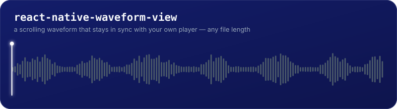

<p align="center">
  
</p>

<p align="center">
  <a href="https://www.npmjs.com/package/react-native-waveform-view"></a>
  <a href="https://www.npmjs.com/package/react-native-waveform-view"></a>
  <a href="./LICENSE"></a>
  
</p>

Also published as [`rn-waveform`](https://www.npmjs.com/package/rn-waveform) — same package, shorter name.

A close-up audio waveform that **scrolls under a fixed playhead**, stays in sync with **your** player, and works on audio of any length — voice notes, podcasts, interviews, lectures.

One bar per 100ms of audio, so bars follow individual words and pauses whether the file is 30 seconds or two hours. Drag to scrub, fling to glide, and the audio seeks once, on release.

## Why another React Native waveform library?

Most React Native waveform libraries own playback and squeeze the whole file into a few hundred bars. That works for a 20-second voice note; a 40-minute recording becomes a flat line, and you have to abandon the player you already use.

This library does the opposite: **it draws, you play.**

- **Bring your own player.** Works with `react-native-track-player`, `react-native-nitro-sound`, `expo-av`, `react-native-video` or anything else. You pass `progress`, `isPlaying` and `playbackRate`; it calls `onSeekEnd`.
- **Long audio stays readable.** The track scrolls instead of compressing, so detail per second is constant at any duration.
- **Smooth at 60fps while playing.** Position is predicted on the UI thread between your player's position reports, and only a handful of SVG paths move per frame.
- **Precompute once, render instantly.** Decode at import time, store the numbers in your own database, and hand them back — no decoding when the screen opens.
- **Perceptual loudness, not raw peaks.** Levels come from dB-averaged 20ms slices, so a quiet pause reads as a short bar rather than noise.

## Install

```sh
npm install react-native-waveform-view
cd ios && pod install
```

Peer dependencies: `react-native-reanimated`, `react-native-gesture-handler`, `react-native-svg`.

A native rebuild is required (the decoders are native). For the smoothest scrolling, enable Reanimated's synchronous UI props in **your app's** `package.json`:

```json
"reanimated": {
  "staticFeatureFlags": {
    "ANDROID_SYNCHRONOUSLY_UPDATE_UI_PROPS": true,
    "IOS_SYNCHRONOUSLY_UPDATE_UI_PROPS": true
  }
}
```

## Usage

```tsx
import { Waveform, useWaveform } from 'react-native-waveform-view';

function Player({ path, player }) {
  const { detail, detailMs, loading } = useWaveform(path);

  if (loading || !detail) return <Placeholder />;

  return (
    <Waveform
      detail={detail}
      detailMs={detailMs}
      durationMs={player.durationMs}
      progress={player.positionMs / player.durationMs}
      isPlaying={player.isPlaying}
      playbackRate={player.rate}
      isSeeking={player.isSeeking}
      onSeekStart={player.beginSeek}
      onSeekEnd={p => player.seekTo(p * player.durationMs)}
      playedColor="#A855F7"
      upcomingColor="#E5E7EB"
      fadeColor="#131D6A"
    />
  );
}
```

### Decode once, store it yourself

```ts
import { decodeWaveform, cacheWaveform } from 'react-native-waveform-view';

// On import/upload:
const waveform = await decodeWaveform(path);      // { overview, detail, detailMs }
await db.save(path, waveform);                    // plain arrays of numbers

// On the next launch, before rendering:
cacheWaveform(path, await db.load(path));         // useWaveform() returns instantly
```

`decodeWaveform(path, { quick: true })` returns a sampled overview in about a second for long files — show it while the full decode runs. `useWaveform()` does this for you.

## API

### `<Waveform />`

| Prop | Type | Default | Notes |
| --- | --- | --- | --- |
| `detail` | `number[]` | required | Normalized levels (0..1), one per `detailMs` |
| `detailMs` | `number` | `100` | Milliseconds per decoded level |
| `msPerBar` | `number` | `detailMs` | Milliseconds a single drawn bar represents. Groups adjacent `detail` values by average for coarser bars; can't go finer than `detailMs` — smaller values are clamped up to it |
| `durationMs` | `number` | required | |
| `progress` | `number` | required | Playback position as 0..1 |
| `isPlaying` | `boolean` | `false` | Drives the internal clock |
| `playbackRate` | `number` | `1` | Keeps 1.5x/2x in sync |
| `isSeeking` | `boolean` | `false` | True while your player seeks |
| `onSeekStart` | `() => void` | | Fires when a drag begins |
| `onSeekEnd` | `(progress: number) => void` | | Fires once, on release |
| `height` | `number` | `64` | |
| `playedColor` / `upcomingColor` / `playheadColor` | `string` | | Flat bar colors |
| `playedGradient` / `upcomingGradient` | `boolean \| { flat?, normal?, peak? } \| { level, color }[] \| string[]` | | Colors each bar by its own loudness instead of a flat color. `true` uses the default yellow→green→red; see [Customization](#customization) |
| `playheadWidth` | `number` | `2` | Line thickness in dp |
| `playheadPreset` | `'line' \| 'thick' \| 'dashed' \| 'glow' \| 'none'` | `'line'` | Ignored if `renderPlayhead` is set |
| `renderPlayhead` | `(info: { color, width, height }) => ReactNode` | | Render your own playhead line instead of a preset |
| `showHandle` | `boolean` | `true` | Draggable-looking knob on the playhead |
| `handleColor` | `string` | `playheadColor` | |
| `handleRadius` | `number` | `5` | Also the size of the slot `renderHandle` centers in |
| `handlePreset` | `'dot' \| 'ring' \| 'pill' \| 'bar' \| 'none'` | `'dot'` | Ignored if `renderHandle` is set |
| `renderHandle` | `(info: { color, radius, dragging }) => ReactNode` | | Render your own handle — an Image, Lottie, icon, anything. `dragging` is live React state, safe to use directly |
| `fadeColor` | `string` | | Background colour the edges fade into; omit for no fade |
| `fadeWidth` | `number` | `64` | |
| `barWidth` / `barGap` | `number` | `3` / `2` | |
| `showTimestamp` | `boolean` | `true` | Bubble under the playhead while scrubbing |

Omit `onSeekEnd` to make the waveform display-only.

### Functions

- `useWaveform(path, { quickFirst?, bins?, stored? })` → `{ samples, detail, detailMs, waveform, loading, failed }`
- `decodeWaveform(path, { quick?, bins? })` → `Promise<WaveformData>`
- `getDurationSeconds(path)` → `Promise<number>`
- `cacheWaveform` / `getCachedWaveform` / `clearWaveformCache`
- `normalizeLoudness(values)` — maps stored 0..1 loudness onto a 40dB display range
- `resampleDetail(detail, detailMs, msPerBar?)` — the pure function behind the `msPerBar` prop, if you want the grouped values yourself

`samples` is a whole-file overview (64 bars by default) if you also want a fixed-width waveform.

## Customization

Same waveform, same shape — only the props change.

<table>
<tr>
<td align="center" width="33%">

<br /><sub><b>Default</b></sub>
</td>
<td align="center" width="33%">

<br /><sub><b>Custom theme</b></sub>
</td>
<td align="center" width="33%">

<br /><sub><b>Intensity gradient</b></sub>
</td>
</tr>
</table>

```tsx
// Default
<Waveform playedColor="#A855F7" upcomingColor="#E5E7EB" />

// Custom theme
<Waveform
  playedColor="#22D3EE"
  upcomingColor="#334155"
  playheadColor="#22D3EE"
  handleColor="#22D3EE"
/>

// Intensity gradient — each bar is colored by its own loudness (quiet → loud),
// not by played/upcoming. true uses the default yellow → green → red stops.
<Waveform playedGradient upcomingGradient />

// ...or pick your own stops:
<Waveform playedGradient={{ flat: '#38BDF8', normal: '#A855F7', peak: '#F472B6' }} />
```

The playhead's handle has built-in presets, or skip them entirely and render your own:

<table>
<tr>
<td align="center" width="33%">

<br /><sub><code>'dot'</code> (default)</sub>
</td>
<td align="center" width="33%">

<br /><sub><code>'ring'</code></sub>
</td>
<td align="center" width="33%">

<br /><sub><code>'pill'</code></sub>
</td>
</tr>
<tr>
<td align="center" width="33%">

<br /><sub><code>'bar'</code></sub>
</td>
<td align="center" width="33%">

<br /><sub><code>'none'</code></sub>
</td>
<td align="center" width="33%">

<br /><sub><code>renderHandle</code> — anything you want</sub>
</td>
</tr>
</table>

```tsx
<Waveform handlePreset="ring" />

// renderHandle fully replaces the preset — an Image, Lottie, icon, anything.
// dragging is live React state, so it's safe to use directly in your styles.
// This is the star pictured above.
<Waveform
  renderHandle={({ color, radius, dragging }) => (
    <Text style={{
      fontSize: radius * 3, color, lineHeight: radius * 3,
      transform: [{ scale: dragging ? 1.3 : 1 }],
    }}>★</Text>
  )}
/>
```

The line itself — not just the knob on top — has the same treatment: presets, or render your own.

<table>
<tr>
<td align="center" width="33%">

<br /><sub><code>'line'</code> (default)</sub>
</td>
<td align="center" width="33%">

<br /><sub><code>'thick'</code></sub>
</td>
<td align="center" width="33%">

<br /><sub><code>'dashed'</code></sub>
</td>
</tr>
<tr>
<td align="center" width="33%">

<br /><sub><code>'glow'</code></sub>
</td>
<td align="center" width="33%">

<br /><sub><code>'none'</code></sub>
</td>
<td align="center" width="33%">

<br /><sub><code>renderPlayhead</code> — anything you want</sub>
</td>
</tr>
</table>

```tsx
<Waveform playheadPreset="glow" />
<Waveform playheadWidth={4} playheadPreset="dashed" />

// renderPlayhead fully replaces the line. This is the zig-zag pictured above.
<Waveform
  renderPlayhead={({ color, width, height }) => (
    <Svg width={16} height={height}>
      <Polyline
        points="8,0 14,9 2,18 14,27 2,36 14,45 8,54"
        fill="none" stroke={color} strokeWidth={width} strokeLinecap="round" strokeLinejoin="round"
      />
    </Svg>
  )}
/>
```

## How the sync works

A player reports its position roughly ten times a second, and each report is already late by the time React re-renders. Following those reports directly produces visible stutter.

Instead, the view keeps its own clock on the UI thread: `position = anchor + elapsed × rate`, evaluated every frame. Each report is compared to that clock and a fraction of the difference is bled in over ~300ms, which reads as a tiny speed change rather than a jump. Only a gap over a second — a real seek — snaps. After a scrub, reports from before the seek are ignored until the player catches up.

## Performance & Budgets

- **Packed Size:** ~43.7 KB packed (`react-native-waveform-view`), 727 bytes (`rn-waveform` alias). Well below the 150 KB ceiling.
- **Dependencies:** **0 runtime dependencies**. Only peer dependencies on standard React Native building blocks (`react-native-svg`, `react-native-reanimated`, `react-native-gesture-handler`).
- **60fps Scrolling:** UI-thread sync clock driven by Reanimated `useFrameCallback`. Zero JS roundtrips during playback and scrubbing.
- **Virtualized Windowing:** Renders in chunks of 64 bars per `<Svg>` path. Only chunks within radius are mounted, holding the RenderNode capacity under 1MB even with hours of audio.

## Limitations

- **Local files only.** No remote URL streaming; download first.
- **No playback and no recording.** This is a view plus a decoder. Live mic waveforms are out of scope.
- **Legacy native module.** It works under both the old and new architecture (Fabric / Bridgeless via the interop layer), but is not yet a codegen TurboModule.
- **Both iOS & Android verified.** Tested natively on Android (MediaCodec) and iOS (AVAudioFile).
- **No web support.**

## FAQ

### How do I show an audio waveform in React Native?

Install `react-native-waveform-view`, decode the file once with `decodeWaveform(path)` or `useWaveform(path)`, and render `<Waveform />` with your player's position. The decoding is native (MediaCodec on Android, AVAudioFile on iOS); no JavaScript audio parsing.

### How do I add a waveform to react-native-track-player?

This library does not play audio, so it pairs with `react-native-track-player` directly: pass `progress` from `useProgress()`, `isPlaying` from `usePlaybackState()`, and call `TrackPlayer.seekTo()` from `onSeekEnd`. The same applies to `react-native-nitro-sound`, `expo-av`, `react-native-video` or a custom native player.

### How do I extract waveform data from an audio file in React Native?

`await decodeWaveform(path)` returns `{ overview, detail, detailMs }` — plain arrays of numbers on 0..1. Store them in your own database and pass them back later, so screens open with no decoding and no spinner.

### Why is my waveform flat for long audio?

Because most waveform views squeeze the whole file into a few hundred bars, and a 40-minute recording averages out to a straight line. This library keeps a constant 100ms per bar and scrolls instead, so detail per second never changes with duration.

### Does it work with the New Architecture (Fabric)?

Yes. The view is plain React Native plus Reanimated and `react-native-svg`; the native decoder is a legacy bridge module that runs under the new architecture through the interop layer.

### Does it work with Expo?

Untested. It needs a native build, so Expo Go is out; a development build with prebuild should work, but nobody has verified it yet.

## Alternatives

| Library | Owns playback | Long audio | Data you can store |
| --- | --- | --- | --- |
| **react-native-waveform-view** | No — use any player | Scrolls, 100ms per bar | Yes |
| [@simform_solutions/react-native-audio-waveform](https://github.com/SimformSolutionsPvtLtd/react-native-audio-waveform) | Yes | Whole file compressed to N bars | Not documented |
| [react-native-waveform-player](https://github.com/maitrungduc1410/react-native-waveform-player) | Yes | Fixed waveform, moving playhead | Yes, via `samples` |
| [react-native-audiowaveform](https://github.com/juananime/react-native-audiowaveform) | Yes | Unmaintained since 2022 | No |

## License

MIT License © 2026 Muhammad Arshad. Released under the [MIT License](LICENSE).

```text
MIT License

Copyright (c) 2026 Muhammad Arshad

Permission is hereby granted, free of charge, to any person obtaining a copy
of this software and associated documentation files (the "Software"), to deal
in the Software without restriction, including without limitation the rights
to use, copy, modify, merge, publish, distribute, sublicense, and/or sell
copies of the Software, and to permit persons to whom the Software is
furnished to do so, subject to the following conditions:

The above copyright notice and this permission notice shall be included in all
copies or substantial portions of the Software.

THE SOFTWARE IS PROVIDED "AS IS", WITHOUT WARRANTY OF ANY KIND, EXPRESS OR
IMPLIED, INCLUDING BUT NOT LIMITED TO THE WARRANTIES OF MERCHANTABILITY,
FITNESS FOR A PARTICULAR PURPOSE AND NONINFRINGEMENT. IN NO EVENT SHALL THE
AUTHORS OR COPYRIGHT HOLDERS BE LIABLE FOR ANY CLAIM, DAMAGES OR OTHER
LIABILITY, WHETHER IN AN ACTION OF CONTRACT, TORT OR OTHERWISE, ARISING FROM,
OUT OF OR IN CONNECTION WITH THE SOFTWARE OR THE USE OR OTHER DEALINGS IN THE
SOFTWARE.
```

<p align="center"></p>
